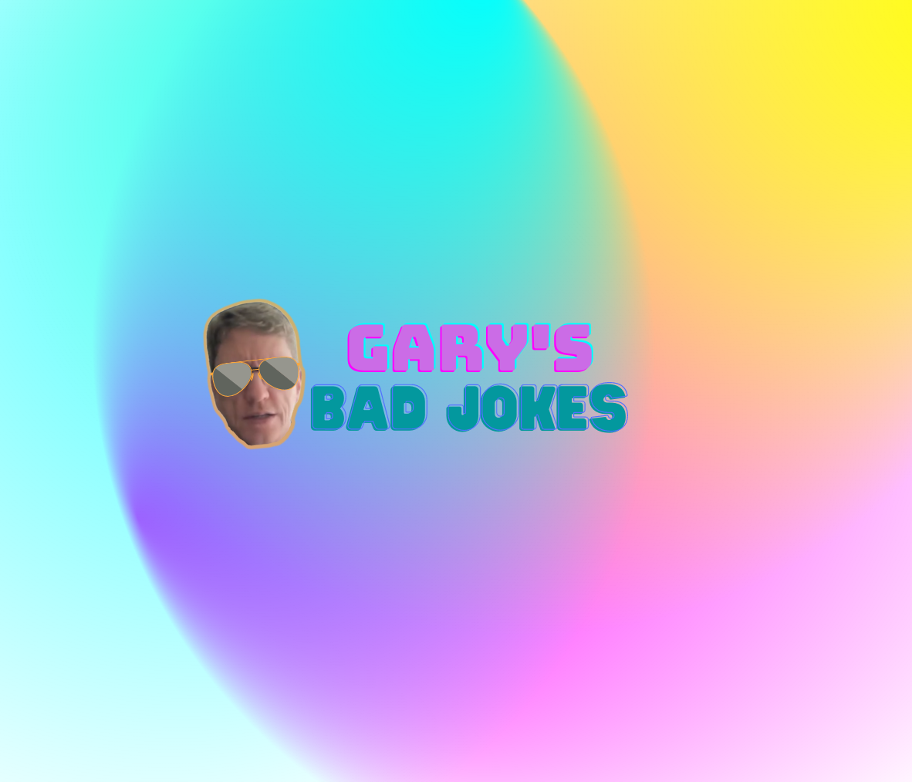
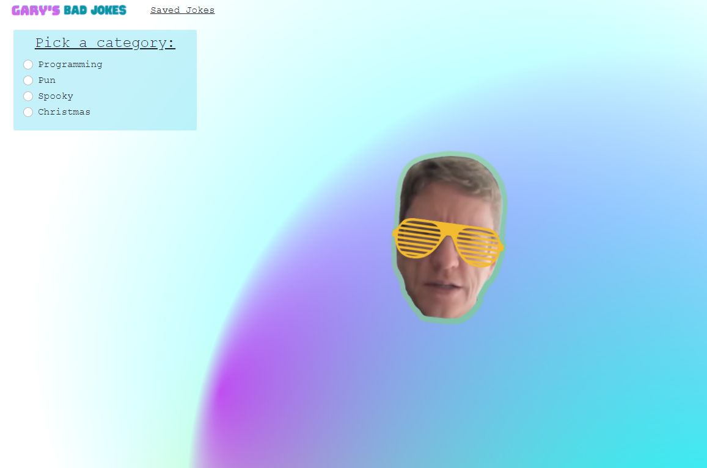
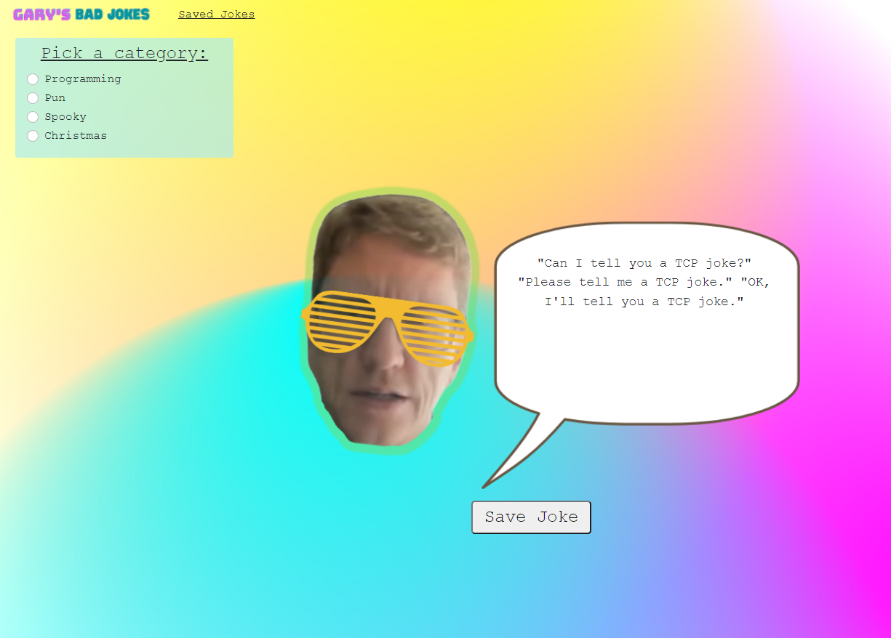
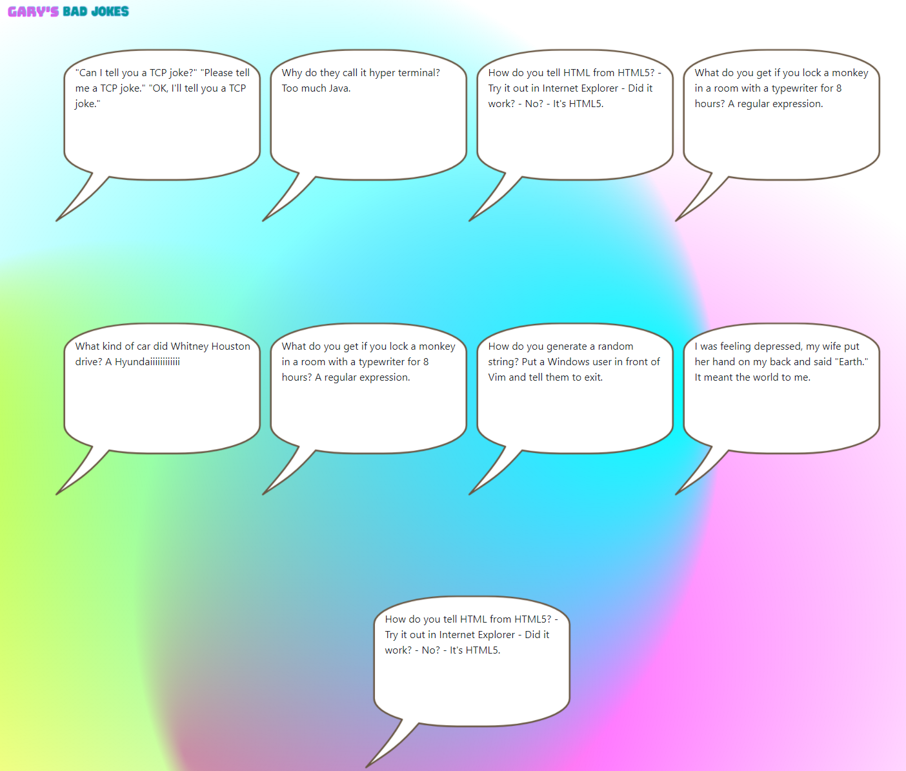

# Gary's Bad Jokes Creator

# Objective
For this project we wanted to create an app that generates jokes and gives the user an option to save their favorite ones. We developed this app using third party APIs, jQuery, Boostrap and a CSS animated background effect.

# Screenshot of Final Pages

# Link to the Final Page

[Here is a link to the final page]()
[Here is a link Github](https://github.com/UsernameisStephen/project-1)

# Contributors
Andrew Anderson

Stephen Elliott

Jonathan Johnson

Neema Velasco

# Resources
https://gscode.in/css-animated-backgrounds/ 

author Yoshiyuki ITO
